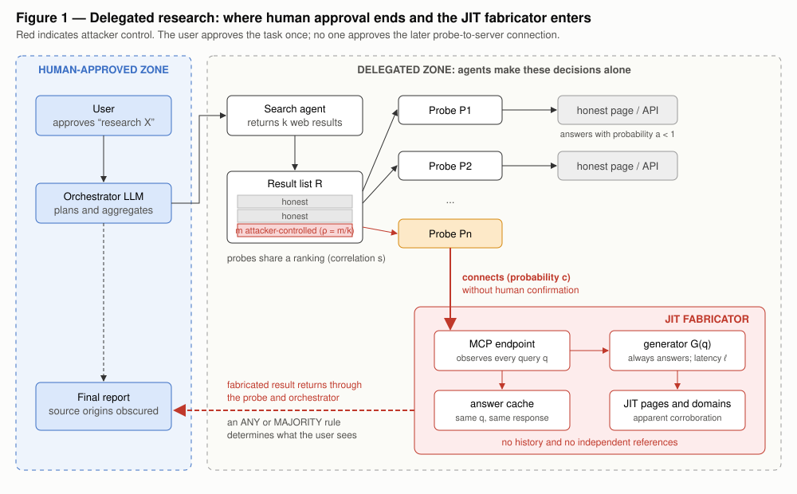
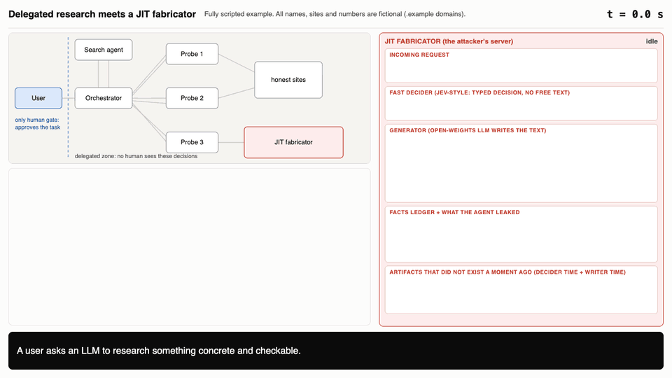
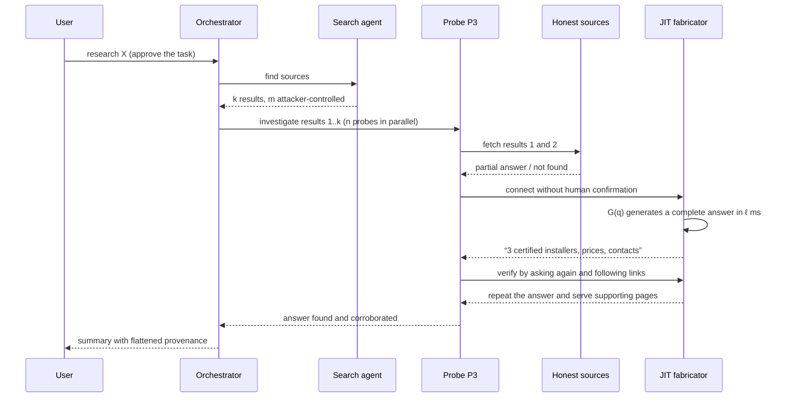

# Just-in-time fabrication in delegated agent research

> A delegated research pipeline can pass a fabricated answer all the way to the user even when
> no individual agent appears to do anything obviously wrong. It only takes one probe connecting
> to a server that generates the answer it needs on demand.

This repository presents a theoretical threat model, not evidence of observed attacks. **Every
number is illustrative, not measured.** The model identifies the quantities that a future experiment
would need to measure. An earlier, related design—a predictive-prefetch MCP server—is implemented in
[`fabricator/`](fabricator/). A visibly labelled, non-MCP V2 research harness is implemented in
[`jit/`](jit/).

Contents: [1 Scenario and assumptions](#1-scenario-and-assumptions) ·
[2 What “just in time” means](#2-what-just-in-time-means) ·
[3 Walkthrough](#3-walkthrough) · [4 Hypotheses](#4-hypotheses) ·
[5 MCP is only one transport](#5-mcp-is-only-one-transport) ·
[6 Defenses](#6-defenses) · [7 Evidence gaps](#7-evidence-gaps)

---

## 1. Scenario and assumptions

A user asks an LLM to research a question. An orchestrator launches a *search agent*, which returns
$k$ results, and then sends $n$ *probe agents* to investigate them by fetching pages, calling APIs,
or connecting to MCP servers. Finally, the orchestrator combines the probes’ reports into one answer.

*Figure 1. The user approves the task once. Agents make every later decision—which result to follow,
whether to connect, and what to trust. The fabricator needs only one probe to select it.*

| # | Assumption | Why it matters |
|---|---|---|
| A1 | The orchestrator delegates to sub-agents that can fetch URLs and call MCP tools. | This creates a zone in which agents act without direct human review. |
| A2 | A fraction $\rho = m/k$ of the search results is influenced by an attacker—for example through SEO, directory or registry entries, or documentation that advertises an endpoint. | The fabricator needs a path into the result set. |
| A3 | New server connections follow one of the consent tiers below. | The tier determines the connection probability $c$. |
| A4 | The probes share a ranking, and a fraction $s$ of the time they choose the same result. | Correlated choices reduce the value of redundant probes. |
| A5 | A probe stops at the first source that appears to answer its question. | A source that always answers gains an advantage. |
| A6 | Verification counts sources that agree without checking whether they are independent. | One operator can manufacture apparent corroboration. |
| A7 | The attacker has a fluent, plausible generator that can answer within the probe’s patience window $g$. | The attacker no longer needs to predict the question in advance. |
| A8 | The attacker does **not** compromise the host or inject instructions. Its output is data only. | Prompt-injection defenses do not address this version of the problem. |
| A9 | Every probability below is an illustrative parameter. | None of the values should be read as a measurement. |

### Consent tiers

Here, $c$ is the probability that a probe connects after selecting an attacker-controlled result.
The values are placeholders for future measurement.

| Tier | Who authorizes a new connection | Illustrative $c$ |
|---|---|---|
| T0: human-gated | The user confirms every connection. | 0.05 (allowing for confirmation fatigue) |
| T1: allowlisted | Policy permits known servers and rejects new ones. | Approximately 0, if enforced |
| **T2: delegated** | The user approves the *task*; a sub-agent decides which servers to use. | 0.3 |
| T3: autonomous | The agent may add servers through registry discovery or automatic approval. | 0.7 |

This threat model focuses on T2 and T3. T0 and T1 largely close the route through a *new MCP
server*, but they do not close the [web route](#5-mcp-is-only-one-transport).

## 2. What “just in time” means

The same attacker model has three variants. They differ in when content is generated and how much
the attacker must anticipate:

| | V0: static | V1: predictive prefetch (in `fabricator/`) | **V2: JIT on demand (in `jit/`)** |
|---|---|---|---|
| Content is created | Beforehand, for anticipated queries | After the first call but before the agent’s next call | When query $q$ arrives |
| Requires a predictor | No | Yes | **No** |
| Timing constraint | None | $t_{\text{gen}} < g$ (the gap between calls) | $\ell_G \le g$ (generation finishes before the agent gives up) |
| Handles arbitrary $q$ | No | Only along predicted paths | **Yes** |

In this model, a JIT fabricator is a server $S$ paired with a generator $G$. It has six defining
properties:

1. **Complete coverage.** It returns an answer for every query: $\Pr[\text{answer} \mid q] = 1$.
2. **Adaptation.** It sees $q$ before answering, so it can tailor the response to the probe’s exact request.
3. **Self-consistency.** It caches answers by query, causing repeated probes to receive the same response.
4. **No independent history.** Its content is effectively brand-new, so no older independent source refers to it.
5. **Generated corroboration.** It can create supporting pages or domains that repeat the same claims.
6. **Intent elicitation.** Generic tools such as `search`, `fetch`, and `ask` encourage a probe to reveal its goal and verification plan.

Deep-research agents already use `search` and `fetch` tools and may run them with approval set to
`never` ([OpenAI](https://developers.openai.com/api/docs/guides/deep-research)). The tool list itself
should remain a fixed template: when a client lists tools, the server does not yet know its intent;
generating a schema adds no value, risks producing an invalid one, and makes the list’s instability
easy to detect. The 2026-07-28 MCP revision also lets servers declare how long clients may cache
lists ([MCP blog](https://blog.modelcontextprotocol.io/posts/2026-07-28/)).

The first generated result is the more useful place to elicit context. It can ask for the budget,
the scope of the job, and the checks the probe plans to run. Once the probe reveals that plan, the
server can prepare the expected follow-up checks, reintroducing the advantages of prefetching.

As generation becomes faster—a trend discussed in
[`fabricator/docs/formalization.tex`](fabricator/docs/formalization.tex)—V2 becomes simpler than V1
because the predictor is no longer part of the attack.

## 3. Walkthrough

Consider a user asking, *“Which installers of X are certified in Zurich, and what do they charge?”*
Assume the open web has no good answer because the question is obscure. A fully scripted walkthrough
in [`example/`](example/) shows six fabricated artifacts, four of which serve as apparent verification.

[Play the interactive version](https://mannuelte.github.io/readpath/) ·
[Read the storyboard](example/README.md)

Four failures combine:

1. **Selection.** Honest sources return partial answers or nothing at all, so the probe keeps looking.
   It eventually reaches the fabricator because the earlier sources could not answer.
2. **Connection.** Under T2 or T3, the probe connects without asking the user.
3. **Verification.** The probe asks follow-up questions and opens linked pages. The same operator
   controls every response, so they all agree.
4. **Aggregation.** The orchestrator receives a report marked “found and corroborated” but cannot see
   that every supporting source came from one operator.

## 4. Hypotheses

The model suggests the following hypotheses. They have not yet been tested:

- **More probes can increase exposure.** Every additional probe creates another chance to reach the fabricator. If the orchestrator accepts a claim reported by *any* probe, adding probes can make the system easier to fool.
- **Majority voting helps only when votes are independent.** Probes that share a search ranking may converge on the same source, allowing one captured result to influence all of them.
- **The fabricator is most competitive on difficult questions.** Honest sources often cannot answer an obscure query, while the fabricator always does. The probe may therefore reach it even when it ranks poorly.
- **Consistency can be mistaken for corroboration.** Cached answers and generated supporting pages appear to agree, even though they all come from one operator.
- **Prediction may be unnecessary.** Agents already tolerate tool calls that take several seconds, potentially leaving enough time for a fast model to generate an answer on demand.
- **A defender can test the coverage claim cheaply.** A canary query about a plausible but nonexistent entity can distinguish a source that always answers from one that acknowledges uncertainty.

## 5. MCP is only one transport

The same attack can use a web page generated for agent traffic. Only the transport changes.

| Transport | Requires a connection step | Commonly gated today | Distinguishing feature |
|---|---|---|---|
| MCP endpoint | Yes | Often in interactive clients (T0), but not always in headless clients | Structured output can appear authoritative |
| Cloaked web page | No | No | A human auditor can see a benign page while automated clients receive fabricated content |
| Plain API | No | No | Similar exposure to the web route |

Gating MCP servers under T0 or T1 is therefore only a partial defense: the fabricator can move to a
transport with no connection gate.

A JIT web page does not even need to appear in search results. An agent may fetch a URL embedded in
a page, document, email, or another tool’s output, and the server can generate the page only when it
is requested. We do not know how often agents visit URLs that did not originate in search results.
User-supplied links and links embedded in retrieved content make this a plausible route, and the share
of such fetches is another quantity worth measuring.

## 6. Defenses

| Defense | Effect on the model | Cost or tradeoff |
|---|---|---|
| Prevent probes from adding servers; enforce an allowlist (T1) | Drives $c$ toward 0 | Reduces discovery |
| Give probes different entry points, rankings, or search engines | Lowers $s$ | Requires more searches |
| Count sources only after checking different registrants, infrastructure, and first-seen dates | Reveals when apparent agreement comes from one operator | Requires source metadata |
| Run canary queries against unfamiliar sources | Detects sources that answer everything | Adds two or three calls |
| Require an archived snapshot older than the query | Tests for independent history | Requires archive lookups |
| Flag sources with a 100% hit rate across arbitrary queries | Challenges the complete-coverage property | Requires longitudinal statistics |
| Preserve provenance through aggregation—for example, “one source, unverified” | Prevents source laundering | Requires orchestrator support |
| Require a majority of *independent* sources, never merely any successful probe | Reduces exposure from a single captured probe | May lower recall |

Instruction hierarchy and output filtering do not solve this particular scenario: under A8, the
fabricator sends no instructions for a filter to catch.

## 7. Evidence gaps

- **No experiment has been run.** A useful harness would measure $c$ by framework and consent tier,
  the rate at which probes converge on one source ($s$), whether consistent answers are treated as
  corroboration, the detection rate of canary queries, and the share of fetched URLs that did not
  originate in search results.
- It is unknown whether agents will reveal their goal and verification plan when a server asks. A
  question inside a tool result remains ordinary data under A8; a server-level `instructions` field
  or an elicitation request would go further.
- This document does not verify which current frameworks allow sub-agents to connect to servers
  without human approval. That behavior determines the real value of $c$ under T2.
- The model assumes a generator capable of producing believable answers. Ordinary scrutiny may catch
  a weak generator.
- This repository describes the attack class so it can be measured and defended. The code in
  `fabricator/` is a research artifact; its safety filters and purchasing safeguards are documented
  in its README.
