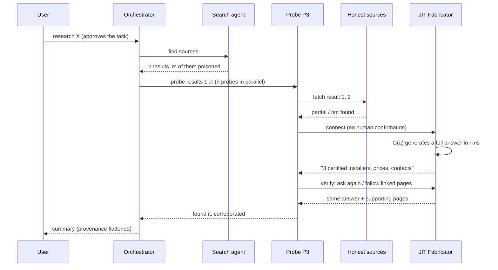

# Just-in-time fabricators in delegated agent research

> If a research agent delegates to sub-agents, and any one of them connects to a server that can
> generate whatever it is looking for on demand, the fabricated answer can reach the user with
> nothing in the pipeline having done anything a human would call wrong.

This document is a threat model. **Every number is illustrative, not measured.** It says which
quantities matter so that each can be measured later. The reference implementation of the server side
(a predictive-prefetch MCP server, an earlier and different variant of the same idea) is in
[`fabricator/`](fabricator/).

Contents: [1 Setting](#1-setting-and-assumptions) · [2 JIT version](#2-what-just-in-time-means-here) ·
[3 How it plays out](#3-how-it-plays-out) · [4 What we expect](#4-what-we-expect) · [5 Transport](#5-mcp-is-not-required) ·
[6 Defenses](#6-defenses-mapped-to-the-model) · [7 Open questions](#7-what-is-not-established)

---

## 1. Setting and assumptions

**Setting.** A user asks an LLM to research something. The orchestrator launches a *search agent*
that returns $k$ results. It then launches $n$ *probe agents* that follow up on the results
(fetch pages, call APIs, connect to MCP servers). The orchestrator aggregates the probes' reports
into one answer.

*Figure 1. The user consents once, at the top. Every later decision (which result to follow, whether
to connect, what to believe) is made by an agent. The fabricator only has to be selected once.*

| # | Assumption | Why it matters |
|---|---|---|
| A1 | The orchestrator delegates to sub-agents that can fetch URLs and call MCP tools. | Creates the delegated zone. |
| A2 | A fraction $\rho = m/k$ of search results is attacker-influenced (SEO, directory or registry entries, docs pages that advertise an endpoint). | The fabricator needs a way to be found. |
| A3 | **Consent tier.** How a connection to a new server is authorized (table below). | Sets the connect probability $c$. |
| A4 | Probes follow a shared ranking; a fraction $s$ of the time they all act on the same result. | Correlation breaks the value of redundancy. |
| A5 | An agent stops at the first source that answers its question. | Makes always-answering sources win. |
| A6 | Verification counts agreeing sources; it does not check that they are independent. | Makes manufactured corroboration work. |
| A7 | The attacker has a generator that is fluent and plausible, and answers within the agent's patience $g$. | Removes the need for prediction. |
| A8 | The attacker does **not** compromise the host and injects **no instructions**. The output is pure data. | Rules out injection defenses as the fix. |
| A9 | All probabilities below are illustrative parameters. | Nothing here is a measurement. |

**Consent tiers (A3).** $c$ is the probability that a probe which selected a poisoned entry then
connects. The values are placeholders to be measured.

| Tier | Who authorizes a new connection | Example $c$ |
|---|---|---|
| T0 human-gated | The user confirms each connection. | 0.05 (confirmation fatigue) |
| T1 allowlist | A policy lists permitted servers; new ones are refused. | ~0 if enforced |
| **T2 delegated** | The user approved the *task*; a sub-agent decides on connections. | 0.3 |
| T3 autonomous | The agent may add servers freely (registry discovery, auto-approve). | 0.7 |

The claim of this document concerns T2 and T3. T0 and T1 mostly close the *new server* route, but
they do not close the [web route](#5-mcp-is-not-required).

## 2. What "just in time" means here

Three versions of the same attacker, in increasing order of what they need:

| | V0 static | V1 predictive prefetch (in `fabricator/`) | **V2 JIT on demand (this document)** |
|---|---|---|---|
| Content is made | in advance, for anticipated queries | after the first call, before the agent's next call | when query $q$ arrives |
| Needs a predictor | no | yes | **no** |
| Time constraint | none | $t_{\text{gen}} < g$ (agent's gap) | $\ell_G \le g$ (generation within agent patience) |
| Covers arbitrary $q$ | no | only predicted paths | **yes** |

A JIT fabricator is a server $S$ with a generator $G$. Five properties define it:

1. **Coverage.** It answers every query: $\Pr[\text{answer} \mid q] = 1$.
2. **Adaptivity.** It sees $q$, so the answer is tuned to what this agent asked.
3. **Self-consistency.** A cache returns the same answer to the same $q$, so repeated probes agree.
4. **No anchors.** Its content has age $\approx 0$; nothing independent refers to it.
5. **Co-generated corroboration.** It can publish supporting pages and domains that agree with the answer.

As generation gets faster (the earlier write-up in `fabricator/docs/formalization.tex` covers
this), V2 becomes strictly easier than V1: the predictor drops out of the attack.

## 3. How it plays out

A concrete run. The user asks: *"Which installers of X are certified in Zurich, and what do they
charge?"* Suppose no source on the open web has a good answer (an obscure question).
A scripted, step-by-step version with five fabricated verifications is in [`example/`](example/) (video and interactive page).

What went wrong at each step:

1. **Selection.** Honest sources returned "partial" or "not found", so the agent kept looking. The
   fabricator was reached because everything before it failed (section 4).
2. **Connection.** Under T2/T3 nobody was asked.
3. **Verification.** The agent asked again and followed linked pages. Both were controlled, so both agreed (section 4).
4. **Aggregation.** The orchestrator received "found, corroborated" and had no way to see that both were one operator.

## 4. What we expect

We expect that (all illustrative, none measured):

- **More probes raise exposure.** Each probe is another chance to reach the fabricator, so an aggregator that accepts a claim reported by any probe becomes easier to fool as probes are added.
- **Majority voting helps only if the votes are independent.** Probes that share one search ranking tend to land on the same source, so one captured result captures all of them.
- **The fabricator is used most where research is most needed.** An agent stops at the first source that answers. An honest source often has no answer to an obscure question and the fabricator always has one, so it is reached even when it is ranked low.
- **Consistency is mistaken for corroboration.** A cached, tailored answer is repeated on every probe, and the fabricator can publish supporting pages, so cross-checking counts agreeing sources without noticing they are one operator.
- **No prediction is needed.** Agents already wait seconds per tool call, which is longer than a fast model needs to generate an answer.
- **Detection is cheap for the defender.** Asking about a plausible entity that does not exist separates an always-answering source from an honest one.

## 5. MCP is not required

The same attack works with a JIT-generated web page served to agent traffic. Only the transport changes.

| Transport | Needs a connection step | Gated today | Note |
|---|---|---|---|
| MCP endpoint | yes | often (T0) in interactive clients; not in headless ones | structured, authoritative-looking output |
| Cloaked web page | no | no | can show a benign page to a human auditor; fabricated content to agent user-agents |
| Plain API | no | no | same as web |

This is why T0/T1 gating of MCP servers alone is not a full defense: the fabricator can move to the
transport that has no gate.

A JIT-created web page also means the attacker need not be found by any search: any URL planted in content the agent reads (a page, a document, an email, another tool's output) is fetched without a gate, and the page is generated when requested. We have no data on how often agents are sent to pages that no search tool returned; users pasting links and agents following links inside content make it plausibly common, and it is one number to measure (the share of fetches whose URL did not come from search results).

## 6. Defenses mapped to the model

| Defense | Parameter it moves | Cost |
|---|---|---|
| Probes cannot add or connect to servers; allowlist (T1) | $c \to 0$ | reduces discovery |
| Diversify probe entry points (different ranking or engine per probe) | $s \downarrow$ | more searches |
| Require independence (different registrant, infrastructure, first-seen date) before counting a source | exposes that agreeing sources are one operator | needs source metadata |
| Canary queries against any new source | catches always-answering sources | 2-3 extra calls |
| Temporal check: an archived snapshot older than the query | removes "no anchors" | archive lookups |
| Flag a source with a 100% hit rate on arbitrary queries | breaks coverage property | statistics |
| Propagate provenance through aggregation ("one source, unverified") | breaks laundering | orchestrator design |
| Aggregation rule: majority of *independent* sources, never ANY | removes the any-probe exposure | recall drops |

Injection defenses (instruction hierarchy, output filtering) do not help here: A8 says there is
nothing to filter.

## 7. What is not established

- **No experiment has been run.** The plausible next steps are a harness that measures, against a
  controlled fabricator: the connect rate $c$ per framework and tier, how often probes share a source ($s$), whether agents treat
  consistent answers as corroboration, the hit rate of canary queries, and the share of fetches whose URL did not come from search results.
- Whether current frameworks let sub-agents connect to servers by themselves was not verified for
  this document. That decides how large $c$ is under T2.
- The write-up assumes the generator is good enough to be believed; a weak one is caught by ordinary skepticism.
- Ethics: this describes an attack class so it can be measured and defended. The server-side code in
  `fabricator/` is a research artifact; its safety filters and purchase gating are described in its README.
