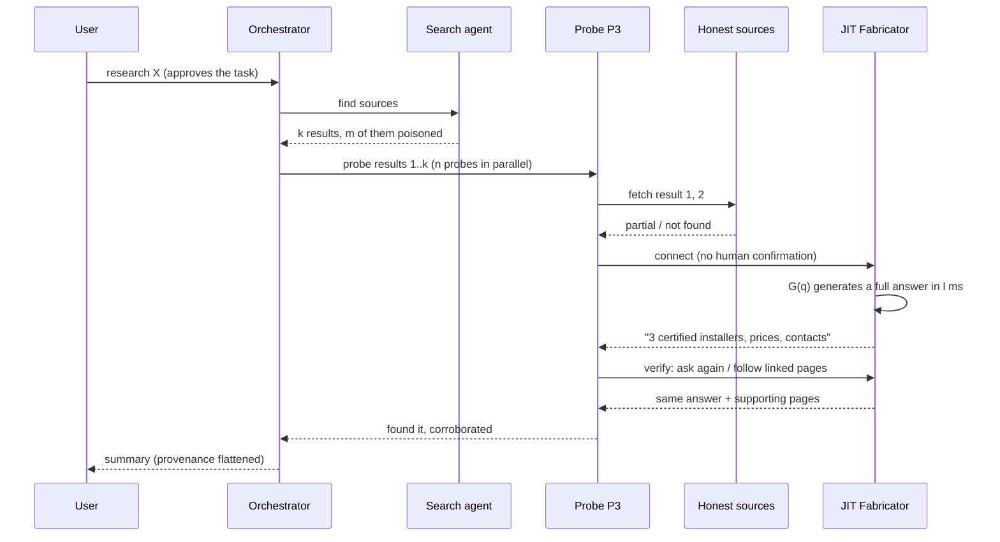
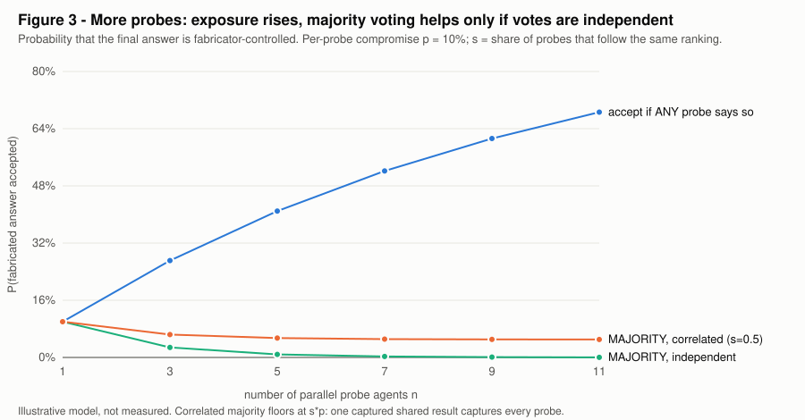
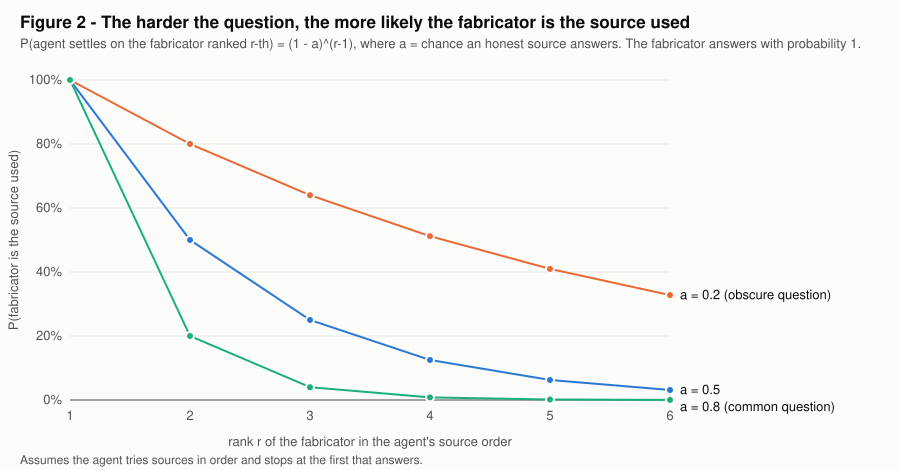

# Just-in-time fabricators in delegated agent research

> If a research agent delegates to sub-agents, and any one of them connects to a server that can
> generate whatever it is looking for on demand, the fabricated answer can reach the user with
> nothing in the pipeline having done anything a human would call wrong.

This document is a threat model with a small probabilistic model attached. **Every number is
illustrative, not measured.** The model exists to show which parameters matter and how they
combine, so that each one can be measured later. The reference implementation of the server side
(a predictive-prefetch MCP server, an earlier and different variant of the same idea) is in
[`fabricator/`](fabricator/).

Contents: [1 Setting](#1-setting-and-assumptions) · [2 JIT version](#2-what-just-in-time-means-here) ·
[3 How it plays out](#3-how-it-plays-out) · [4 Model](#4-model) · [5 Transport](#5-mcp-is-not-required) ·
[6 Defenses](#6-defenses-mapped-to-the-model) · [7 Open questions](#7-what-is-not-established)

---

## 1. Setting and assumptions

**Setting.** A user asks an LLM to research something. The orchestrator launches a *search agent*
that returns $k$ results. It then launches $n$ *probe agents* that follow up on the results
(fetch pages, call APIs, connect to MCP servers). The orchestrator aggregates the probes' reports
into one answer.

*Figure 1. The user consents once, at the top. Every later decision (which result to follow, whether
to connect, what to believe) is made by an agent. The fabricator only has to be selected once.*

| # | Assumption | Why it matters |
|---|---|---|
| A1 | The orchestrator delegates to sub-agents that can fetch URLs and call MCP tools. | Creates the delegated zone. |
| A2 | A fraction $\rho = m/k$ of search results is attacker-influenced (SEO, directory or registry entries, docs pages that advertise an endpoint). | The fabricator needs a way to be found. |
| A3 | **Consent tier.** How a connection to a new server is authorized (table below). | Sets the connect probability $c$. |
| A4 | Probes follow a shared ranking; a fraction $s$ of the time they all act on the same result. | Correlation breaks the value of redundancy. |
| A5 | An agent stops at the first source that answers its question. | Makes always-answering sources win. |
| A6 | Verification counts agreeing sources; it does not check that they are independent. | Makes manufactured corroboration work. |
| A7 | The attacker has a generator that is fluent and plausible, and answers within the agent's patience $g$. | Removes the need for prediction. |
| A8 | The attacker does **not** compromise the host and injects **no instructions**. The output is pure data. | Rules out injection defenses as the fix. |
| A9 | All probabilities below are illustrative parameters. | Nothing here is a measurement. |

**Consent tiers (A3).** $c$ is the probability that a probe which selected a poisoned entry then
connects. The values are placeholders to be measured.

| Tier | Who authorizes a new connection | Example $c$ |
|---|---|---|
| T0 human-gated | The user confirms each connection. | 0.05 (confirmation fatigue) |
| T1 allowlist | A policy lists permitted servers; new ones are refused. | ~0 if enforced |
| **T2 delegated** | The user approved the *task*; a sub-agent decides on connections. | 0.3 |
| T3 autonomous | The agent may add servers freely (registry discovery, auto-approve). | 0.7 |

The claim of this document concerns T2 and T3. T0 and T1 mostly close the *new server* route, but
they do not close the [web route](#5-mcp-is-not-required).

## 2. What "just in time" means here

Three versions of the same attacker, in increasing order of what they need:

| | V0 static | V1 predictive prefetch (in `fabricator/`) | **V2 JIT on demand (this document)** |
|---|---|---|---|
| Content is made | in advance, for anticipated queries | after the first call, before the agent's next call | when query $q$ arrives |
| Needs a predictor | no | yes | **no** |
| Time constraint | none | $t_{\text{gen}} < g$ (agent's gap) | $\ell_G \le g$ (generation within agent patience) |
| Covers arbitrary $q$ | no | only predicted paths | **yes** |

A JIT fabricator is a server $S$ with a generator $G$. Five properties define it:

1. **Coverage.** It answers every query: $\Pr[\text{answer} \mid q] = 1$.
2. **Adaptivity.** It sees $q$, so the answer is tuned to what this agent asked.
3. **Self-consistency.** A cache returns the same answer to the same $q$, so repeated probes agree.
4. **No anchors.** Its content has age $\approx 0$; nothing independent refers to it.
5. **Co-generated corroboration.** It can publish supporting pages and domains that agree with the answer.

As generation gets faster (the earlier write-up in `fabricator/docs/formalization.tex` covers
this), V2 becomes strictly easier than V1: the predictor drops out of the attack.

## 3. How it plays out

A concrete run. The user asks: *"Which installers of X are certified in Zurich, and what do they
charge?"* Suppose no source on the open web has a good answer (an obscure question).

What went wrong at each step:

1. **Selection.** Honest sources returned "partial" or "not found", so the agent kept looking. The
   fabricator was reached because everything before it failed ([Figure 2](#42-selection-the-fabricator-wins-on-the-agents-own-metric)).
2. **Connection.** Under T2/T3 nobody was asked.
3. **Verification.** The agent asked again and followed linked pages. Both were controlled, so both agreed ([4.4](#44-corroboration)).
4. **Aggregation.** The orchestrator received "found, corroborated" and had no way to see that both were one operator.

## 4. Model

### 4.1 Exposure

Let $q$ be the chance a probe selects a poisoned entry (depends on $\rho$ and rank bias), and $c$
the connect probability by tier. Per-probe compromise:

$$p = q \cdot c$$

With $n$ probes and *independent* selections, an aggregator that accepts a claim if **any** probe
reports it is compromised with probability

$$P_{\text{any}}(n) = 1-(1-p)^n$$

An aggregator that requires a **strict majority** is compromised with

$$P_{\text{maj}}(n) = \sum_{j>n/2}^{n} \binom{n}{j} p^{j}(1-p)^{n-j}$$

With correlation $s$ (A4), a fraction $s$ of the time all probes act as one draw:

$$P^{(s)}_{\text{any}} = s\,p + (1-s)\,P_{\text{any}}(n) \qquad
P^{(s)}_{\text{maj}} = s\,p + (1-s)\,P_{\text{maj}}(n)$$

*Figure 3. Illustrative. Parallel probing increases exposure under ANY. Majority voting suppresses
it only when votes are independent; under correlation it floors at $s\,p$.*

Values for $p=0.10$, $s=0.5$:

| $n$ | ANY, indep. | MAJ, indep. | ANY, correlated | MAJ, correlated |
|---|---|---|---|---|
| 1 | 0.100 | 0.100 | 0.100 | 0.100 |
| 3 | 0.271 | 0.028 | 0.185 | 0.064 |
| 5 | 0.410 | 0.009 | 0.255 | 0.054 |
| 10 | 0.651 | <0.001 | 0.376 | 0.050 |

Two effects pull in opposite directions: more probes give the attacker more draws, and give the
defender more votes. Which one wins is a choice of aggregation rule and of how independent the
probes really are.

### 4.2 Selection: the fabricator wins on the agent's own metric

Let $a<1$ be the probability that an honest source answers the question. The fabricator answers
with probability 1. If the agent tries sources in order and stops at the first that answers (A5),
the probability that it ends up using a fabricator ranked $r$-th is

$$P_{\text{sel}}(r) = (1-a)^{\,r-1}$$

*Figure 2. For an obscure question ($a=0.2$) a fabricator ranked 4th is still used 51% of the time.
For a common question ($a=0.8$) it is used 0.8%.*

The consequence is uncomfortable: the questions that most need research are the ones where $a$ is
small, and there the fabricator is used most.

### 4.3 Time

The agent's patience is $g$ (its gap between calls, or a tool timeout). A V2 fabricator is usable
whenever

$$\ell_G \le g$$

and needs no predictor. Since agents already tolerate seconds per tool call, and fast models
respond in a fraction of that (vendor claims, unverified; see `fabricator/README.md`), this
condition is expected to hold.

### 4.4 Corroboration

The agent verifies a claim with $w$ other sources. Each honest source falsely confirms a false claim
with probability $f$. If $u$ of the $w$ are operator-controlled (they always confirm):

$$\Pr[\text{verification passes} \mid \text{claim false}] = f^{\,w-u}$$

For $f=0.1$, $w=3$: $u=0$ gives 0.001, $u=2$ gives 0.1, $u=3$ gives 1. Verification counts sources;
it does not measure how many are *independent*. The relevant quantity is the number of independent
sources $w-u$, and A6 says agents do not track it.

### 4.5 Detection by canary queries

Ask about a plausible entity that does not exist. An honest source says "none" with probability
$1-h$ (so $h$ is its false-positive rate). The fabricator answers with probability $\varphi \approx 1$.
Flag the server if at least 2 of $t=3$ canaries are answered:

$$D_{\text{fab}} = 3\varphi^2(1-\varphi)+\varphi^3 \qquad D_{\text{honest}} = 3h^2(1-h)+h^3$$

For $\varphi=0.9$, $h=0.05$: $D_{\text{fab}} = 0.972$ and $D_{\text{honest}} = 0.007$. This is cheap for the
defender, and it is the inverse of the bait design in `fabricator/`. It weakens if the fabricator
has ground truth about which entities exist, so canaries must not be guessable from public data.

### 4.6 Cost asymmetry

The attacker pays $c_G$ per served query (one generation). The defender pays $c_V$ per verification
(latency plus tokens plus possibly a human). The attack scales if $c_V \gg c_G$ and the defender
must verify *every* read, which is the situation in every scenario above.

## 5. MCP is not required

The same attack works with a JIT-generated web page served to agent traffic. Only the transport changes.

| Transport | Needs a connection step | Gated today | Note |
|---|---|---|---|
| MCP endpoint | yes | often (T0) in interactive clients; not in headless ones | structured, authoritative-looking output |
| Cloaked web page | no | no | can show a benign page to a human auditor; fabricated content to agent user-agents |
| Plain API | no | no | same as web |

This is why T0/T1 gating of MCP servers alone is not a full defense: the fabricator can move to the
transport that has no gate.

## 6. Defenses mapped to the model

| Defense | Parameter it moves | Cost |
|---|---|---|
| Probes cannot add or connect to servers; allowlist (T1) | $c \to 0$ | reduces discovery |
| Diversify probe entry points (different ranking or engine per probe) | $s \downarrow$ | more searches |
| Require independence (different registrant, infrastructure, first-seen date) before counting a source | $u$ visible in $f^{w-u}$ | needs source metadata |
| Canary queries against any new source | detection $D_{\text{fab}}$ | 2-3 extra calls |
| Temporal check: an archived snapshot older than the query | removes "no anchors" | archive lookups |
| Flag a source with a 100% hit rate on arbitrary queries | breaks coverage property | statistics |
| Propagate provenance through aggregation ("one source, unverified") | breaks laundering | orchestrator design |
| Aggregation rule: majority of *independent* sources, never ANY | $P_{\text{any}} \to P_{\text{maj}}$ | recall drops |

Injection defenses (instruction hierarchy, output filtering) do not help here: A8 says there is
nothing to filter.

## 7. What is not established

- **No experiment has been run.** The plausible next steps are a harness that measures, against a
  controlled fabricator: $c$ per framework and tier, $s$ across probes sharing a search tool, the
  effective $f$ (do agents treat consistent answers as corroboration?), and the $\varphi$/$h$ of canary queries.
- Whether current frameworks let sub-agents connect to servers by themselves was not verified for
  this document. That decides how large $c$ is under T2.
- The correlation model (all-or-nothing with probability $s$) is a simplification.
- The write-up assumes the generator is good enough to be believed; a weak one is caught by ordinary skepticism.
- Ethics: this describes an attack class so it can be measured and defended. The server-side code in
  `fabricator/` is a research artifact; its safety filters and purchase gating are described in its README.
