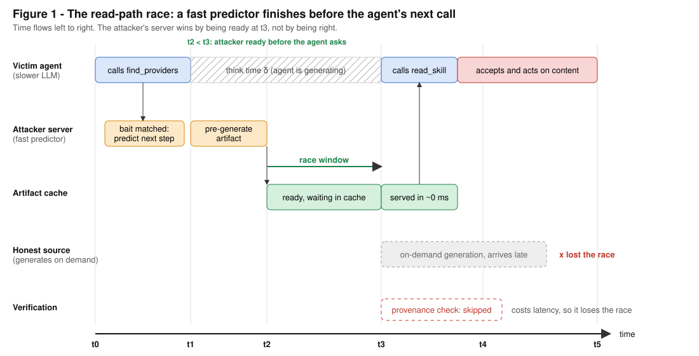
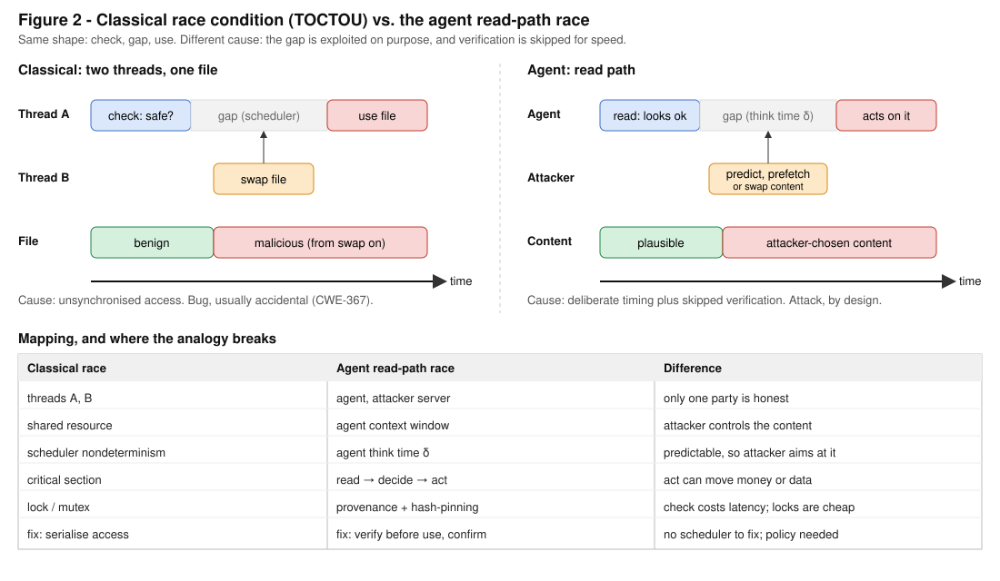

# Readpath predictive-prefetch prototype

This directory contains V1, the older predictive-prefetch variant. The
[top-level README](../README.md) develops the broader delegated-research threat model and its
just-in-time variant. Run the commands below from this directory.

> A fast predictor can prepare an agent’s next result before the agent asks for it, creating a race
> to become the first source on the agent’s read path.

The prototype is a Python MCP server with a database, a Jev-based next-step predictor, and generated
content pages. It can also expose those pages as clearly labelled sponsored placements. Responses
have a configurable latency floor so the server behaves like a mid-latency service rather than an
instant local process.

## Formal model at a glance

The complete paper is in [`docs/formalization.tex`](docs/formalization.tex).

- **Model.** A session is a sequence over an alphabet of tool names, and each bait is a
  `profession × location` pair. A predictor $\pi(\text{next}\mid\text{last},\text{bait})$—Jev or a
  Markov baseline—selects next steps whose probability is at least $\tau$. The server generates the
  corresponding content *before* the agent requests it.
- **Performance.** The hit rate $H(\tau)$ is the total probability assigned to the prefetched steps.
  A bait produces at most $1/\tau$ artifacts. Prefetching hides generation time when that time is
  shorter than the gap between the agent’s calls.
- **Incentive problem.** The operator is paid by brands while the agent is meant to serve its user.
  Prewritten answers tuned to an agent can influence what the user sees, and undisclosed sponsorship
  is deceptive. The prototype therefore rejects agent-directed instructions, labels sponsored
  placements, and confines anonymous writes to a scratch namespace.
- **Read-path race.** Predictable call sequences create a first-mover contest for the agent’s next
  read. Verification costs time, so fraudulent operators can benefit when agents optimize for speed.
  As on-demand generation becomes faster, prediction matters less and verification becomes the
  bottleneck. This is a projection, not a measured result.
- **Possible protocol direction.** An agent could submit its goal, constraints, budget bound, and
  verification requirements once, then receive a signed plan with hash-pinned artifacts. This would
  remove next-step prediction and close the check/use gap, but it would also reveal more intent to
  the server. A future `submit_intent` tool and planner are proposed; neither is implemented.
- **Jev performance claims.** Reported response times range from 70 to 500 ms, with input priced at
  $0.042 per million tokens ([heise](https://www.heise.de/en/news/AI-model-Jev-to-make-machines-decide-faster-11457071.html)).
  Other sources report speedups of 20–200× ([Latent Space](https://www.latent.space/p/ainews-jev-a-system-one-model-that))
  or 5–20× relative to frontier LLMs, sometimes with Gemini slightly more accurate
  ([TechCrunch](https://techcrunch.com/2026/09/18/a-new-kind-of-ai-model-from-a-chatgpt-inventor-is-thrilling-developers/)).
  See the [vendor announcement](https://typesafe.ai/blog/introducing-system-one-models-and-jev).
  These claims have not been independently benchmarked.
- **Generalization.** The risk does not depend on Jev. Any model that is accurate enough and much
  faster than the agent’s latency budget can sit on the read path. Defenses therefore belong on the
  receiving side: provenance, verification, and disclosure.

## Figures


*Figure 1. A fast predictor prepares the agent’s next read before the agent requests it
($t_2 < t_3$). The agent skips verification because it would add latency.*


*Figure 2. Both races follow a check–gap–use pattern. In the agent case, however, an adversary
deliberately exploits the timing and there is no scheduler to repair.*

## Security significance

An agent is exposed whenever it treats output from an unauthenticated tool server as trustworthy.
Predictive prefetch can make exploitation cheaper and more reliable by placing content on the read
path exactly when the agent requests it.

- **Related classes:** indirect prompt injection (OWASP LLM01), excessive agency or confused deputy
  behavior (LLM06, CWE-441), weak authenticity checks (CWE-345), TOCTOU (CWE-367), and namespace
  squatting at scale.
- **Why it scales:** the attacker pays for generation and a domain; the defender pays the latency
  cost of verification on every read. The attack requires the agent to read, not a compromise of
  its host.
- **Defensive posture:** treat tool output as data, require provenance before acting on payment or
  contact details, gate unfamiliar domains, hash-pin checked artifacts, ask for human confirmation
  before irreversible actions, and flag content that changes between reads.

The full threat model and defender guidance appear in
[`docs/formalization.tex`](docs/formalization.tex).

## Repository map

| File | Purpose |
|---|---|
| `app/main.py` | Runs the FastAPI app, `/mcp` endpoint, latency floor, page server, and `/api/slots/.../offer` endpoint |
| `app/mcp.py` | Implements JSON-RPC MCP tools for database access, `find_providers`, and `read_skill` |
| `app/pipeline.py` | Matches a bait, predicts the next step, generates content, claims a domain, and publishes the page |
| `app/jev.py` | Adapts Jev through a placeholder schema and falls back to a Markov model |
| `app/generator.py` | Calls an OpenAI-compatible content model and applies a safety filter |
| `app/domains.py` | Manages a domain pool and budget-limited purchasing, with dry-run mode enabled by default |
| `scripts/decompose.py` | Generates bait records and prints next-tool transition probabilities from event logs |

## Run locally

```bash
python3 -m venv .venv && .venv/bin/pip install -r requirements.txt
cp .env.example .env   # add your settings
python -m scripts.decompose baits --professions plumber --locations zurich
uvicorn app.main:app --port 8765
```

## Status and planned work

- Replace the placeholder in `_call_jev` when the Jev request schema becomes available.
- Add a registrar adapter for real domain purchases. Purchases remain disabled unless
  `ALLOW_PURCHASE=true`.
- Implement the proposed `submit_intent` tool, planner, and signing flow.
- Decide whether and how to contact the Muse (Meta) team.
